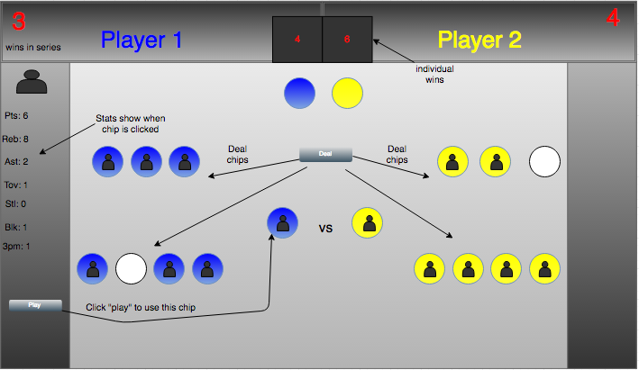

#Jumpball

##Javascript-based Multiplayer game

Players choose between "Home" and "Away".  Each side is dealt 7 chips, represented by NBA stars, and take turns playing chips until there is a winner. A chip's value is based on the NBA player's stats, and each category is weighted according to the scoring system chosen before the game starts.

The team to "play" first is based on a 2-2-1-1-1 series format.  The possession arrow indicates who's turn it is.

##Controls

* Click "Deal" button to start game
* When it's your turn, click on any chip to see the player stats(unweighted) in the sidebar
* Click "play" to to use that chip against the opponent

##To play

Visit https://djw11192.github.io/project1/, or download a .zip of this repo and open index.html in your browser.

##Development Process

Technologies used: HTML/CSS/Javascript + Jquery

A constructor function creates new Player objects which are put into an array and randomized once the "Deal" button is clicked.  After they're randomized, the first 14 objects are moved to a new array that is referenced for later operations.

The objects from the new array are assigned as attributes to each chip. This includes all statistical categories and a total(sum) value that is calculated using the weighted settings chosen before the game. When both sides "play" a chip, the one with the higher total value wins the matchup.

##Not-Yet-Implemented

* Keep track of each round and play a 7 game series
* Last two chips automatically "play"
* Add more Player objects
* Create new game modes

##User Stories

As a user, I have the option of comparing my chips before choosing one to "play"

As a user, I can customize the scoring system the way I value certain statistical categories

As a user I can play multiple games without reading the rules and scoring options again. I simply click "Deal"

###Future Implementations

As a player, I can choose game modes with more diverse scoring systems.

As a player, I can choose between a random dealing of chips or drafting players
